# ADR-001 数据库 Schema 设计（M1 核心模型）

- **状态**：已采纳
- **日期**：2026-09-15
- **背景**：M1 需要为学情闭环（F-01~F-47）提供数据基座，覆盖账号、订阅、题库、画像、计划、对话、测评、批改、审计与内容安全。

## 决策

1. **主键统一 UUID（`uuid4`）**：便于多端离线生成与后续分库，避免自增 ID 暴露业务规模。
2. **时间戳统一带时区（`TIMESTAMPTZ`）**：客户端默认值 + `server_default now()` 双保险。
3. **枚举字段采用 `VARCHAR + CHECK`（SQLAlchemy `Enum(native_enum=False, create_constraint=True)`）**：迁移更友好（新增枚举值不需要 `ALTER TYPE`）。
4. **弹性字段使用 JSONB**（如 `plans.meta`、`chat_sessions.meta`、`grading_records.result`）：业务仍在快速演进，避免过度规范化。
5. **不声明 ORM `relationship()`**：全部使用显式查询（`select().where()`），降低隐式懒加载风险，便于 mypy --strict。
6. **约束统一命名**（`ix_/uq_/ck_/fk_/pk_` 前缀）：保证 Alembic autogenerate 稳定。
7. **单一初始迁移**：M1 落 `initial schema` 一条迁移；后续里程碑增量迁移，禁止改写历史迁移。

## 表清单（26 张）

| 领域 | 表 | 说明 |
|------|----|------|
| 账号 | `users` / `refresh_tokens` / `sms_codes` / `parent_children` / `parent_controls` | 用户、刷新令牌轮换、验证码、家长绑定、防沉迷 |
| 订阅 | `subscriptions` / `checkouts` | free/trial/pro 三态 + mock 收银台 |
| 题库 | `knowledge_points` / `knowledge_edges` / `mistake_tags` / `questions` / `question_knowledge_points` / `question_mistake_tags` | 知识图谱（前置依赖边）、题目三态审核、错因标签 |
| 学情 | `learning_profiles` / `mastery_records` / `mistake_book_entries` / `plans` / `plan_tasks` / `review_cards` | 行为画像、BKT 掌握度、错题本、计划任务、FSRS 卡片 |
| 对话 | `chat_sessions` / `chat_messages` | 会话（含 hint_level 与 solo_locked 锁）、消息留痕 |
| 测评批改 | `exams` / `exam_answers` / `grading_records` | 模考/独立测评、逐题诊断、各类型批改记录 |
| 审计安全 | `audit_logs` / `safety_events` | 操作审计、内容安全事件（F-42 数据源） |

## ER 图（核心关系）

```mermaid
erDiagram
    users ||--o| subscriptions : "拥有"
    users ||--o{ refresh_tokens : "令牌轮换"
    users ||--o{ checkouts : "收银台"
    users ||--o{ parent_children : "家长绑定"
    users ||--o{ parent_controls : "防沉迷设置"
    users ||--o| learning_profiles : "行为画像"
    users ||--o{ mastery_records : "掌握度"
    users ||--o{ mistake_book_entries : "错题本"
    users ||--o{ plans : "计划"
    plans ||--o{ plan_tasks : "任务卡"
    users ||--o{ review_cards : "复习卡"
    users ||--o{ chat_sessions : "会话"
    chat_sessions ||--o{ chat_messages : "消息"
    users ||--o{ exams : "测评"
    exams ||--o{ exam_answers : "逐题作答"
    users ||--o{ grading_records : "批改"
    knowledge_points ||--o{ knowledge_edges : "前置依赖"
    knowledge_points ||--o{ mastery_records : "被掌握度引用"
    questions ||--o{ question_knowledge_points : "知识点关联"
    questions ||--o{ question_mistake_tags : "错因关联"
    questions ||--o{ mistake_book_entries : "被错题本引用"
    questions ||--o{ exam_answers : "被作答引用"
    questions ||--o{ review_cards : "被复习卡引用"
    users ||--o{ safety_events : "安全事件"
    users ||--o{ audit_logs : "审计"
```



## 关键字段约定

- `users.role`：`student` / `parent` / `admin`；`is_k12` 作为未成年人保护策略入口。
- `chat_sessions.solo_locked`：无辅助测评期间为 `true`，服务端据此拒绝提示类接口（F-28 红线）。
- `mastery_records`：存 BKT 参数（`mastery`、`alpha`、`beta`）与答题计数，`uq_mastery_user_kp` 保证每用户每知识点一行。
- `mistake_book_entries.removed_at`：重练通过后置位（软移出，保留历史）。
- `review_cards`：存 FSRS 状态（`stability` / `difficulty` / `due_at` / `reps` / `lapses`）。

## 迁移策略

```bash
cd services/api
alembic upgrade head          # 应用
alembic downgrade base        # 回滚
alembic revision --autogenerate -m "描述"   # 新增增量迁移
```

验收证据见 `docs/verification/M1_2026-09-15.md`（upgrade → downgrade → upgrade 无损往返）。
