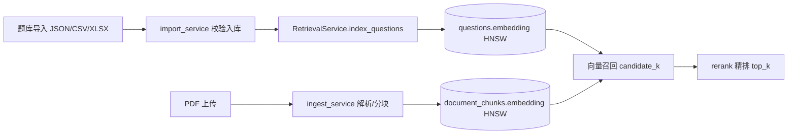

# ADR-002 RAG 存储与检索设计（M2）

- **状态**：已采纳
- **日期**：2026-09-15
- **背景**：T2.4/T2.5 需要题目检索（F-17 智能出题、F-36 拍照搜题的召回底座）与教材问答（F-37）的向量存储。

## 决策

1. **向量维度固定 1024**（`EMBEDDING_DIMS`，对齐 bge-m3），题目向量直接落在 `questions.embedding`，文档分块落在 `document_chunks.embedding`（`pgvector` 类型）。
2. **索引采用 HNSW + 余弦距离**（`vector_cosine_ops`）：查询与写入性能均衡，适合当前数据规模；后续如需可切换 IVFFlat。
3. **供应商以接口隔离，仅改环境变量切换**（规格书 §0.8）：
   - Embedding：`mock`（本地词面哈希，离线开发/CI）↔ `siliconflow`（BAAI/bge-m3 真实语义向量）
   - Rerank：`mock`（词面 Jaccard）↔ `siliconflow`（BAAI/bge-reranker-v2-m3）
4. **两段式检索**：向量召回 `candidate_k`（默认 top_k×4，下限 20）→ 重排取 `top_k`；重排失败时自动回退向量分数排序。
5. **索引文本含学科前缀**：`"{subject} {stem}"`；演示题库题干带 `[知识点]` 前缀，保证词面检索可验证。
6. **文档分块策略**：段落聚合 + `max_chars=600` + 尾部 `overlap=80`，块内保留页码区间（`page_from/page_to`），满足 F-37「回答带页码引用」要求。
7. **迁移自建扩展**：向量迁移内执行 `CREATE EXTENSION IF NOT EXISTS vector`，保证全新环境（CI/生产/测试库）零手工步骤。

## 数据流

## 验收对照

| 指标 | 目标 | 实测 |
|------|------|------|
| 题库导入（1000+ 条样例） | 0 错误 | 1114 行 0 非法，1105 入库（9 条同文件重复自动跳过） |
| 知识点规模 | ≥300 且无环 | 641 节点 / 836 前置边，Kahn 拓扑排序通过 |
| 演示题库 | 数学/英语各 ≥500 | 数学 565 / 英语 540 |
| 解析覆盖率 | ≥95% | 100% |
| 检索召回率@5（30 问） | ≥90% | 100%（mock 词面召回；语义召回待真实 Key 复测） |
| 100 页 PDF 入库 | ≤5 分钟 | 2.05 秒 |

## 风险与后续

- **语义召回尚未用真实 bge-m3 验证**：当前 100% 为词面召回指标；接入硅基流动 Key 后需用真实语义向量复测（BLOCKERS B-003）。
- **rerank 阈值**：mock 重排为词面代理，真实 bge-reranker 接入后需校准 `top_k` 与分数归一化策略。
